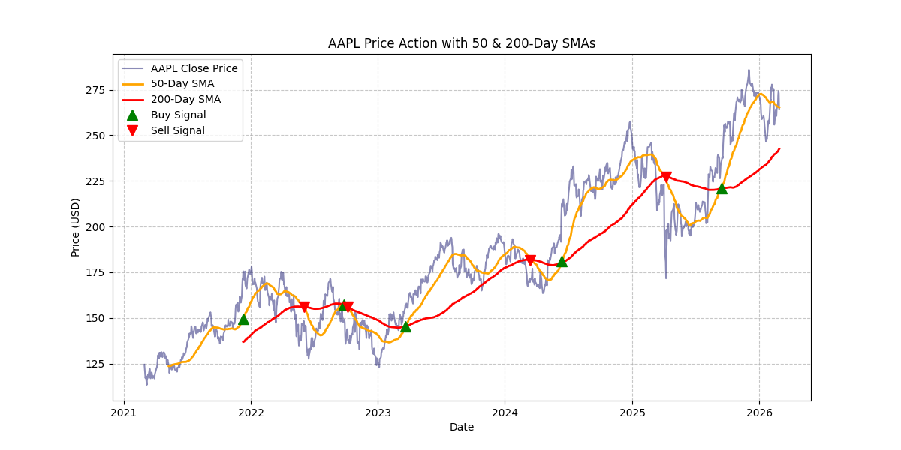
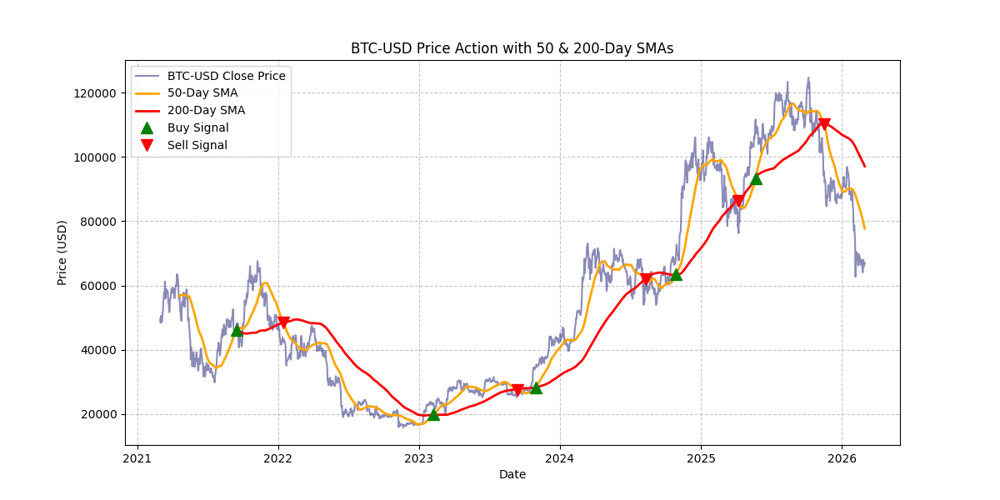
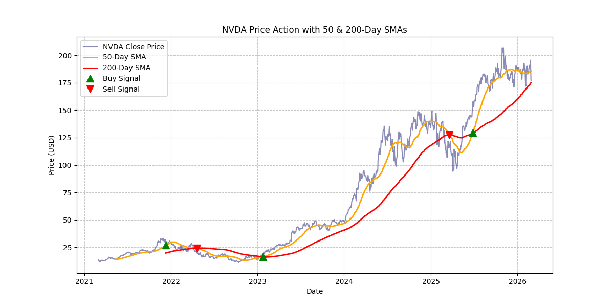

# quant-finance-sma-bot
Python-based quantitative analysis script that detects algorithmic trading signals using 50-day and 200-day Simple Moving Average (SMA) crossovers.
# Algorithmic Trading: SMA Crossover Bot

A Python-based quantitative analysis script that fetches historical market data, applies technical indicators, and generates automated algorithmic trading signals based on Simple Moving Average (SMA) crossovers.







## Key Features

* **Data Ingestion:** Automated fetching of historical daily market data using the `yfinance` API.
* **Technical Analysis:** Calculates 50-day (short-term) and 200-day (long-term) Simple Moving Averages to identify macro trends and filter out market noise.
* **Automated Signal Generation:** Utilizes `numpy` vectorization to efficiently scan the time series and pinpoint exact "Golden Cross" (Buy) and "Death Cross" (Sell) signals.
* **Data Visualization:** Renders a clean, professional financial chart using `matplotlib` to visually verify the price action alongside the SMA indicators and trading signals.

## Tech Stack

* **Language:** Python
* **Data Manipulation:** Pandas, NumPy
* **Market Data API:** yfinance
* **Visualization:** Matplotlib

# How to Run

1. Clone this repository to your local machine.
2. Install the required dependencies:
   ```bash
   pip install yfinance pandas numpy matplotlib
3. Run the script
 Note: The script is currently set to analyze Apple (AAPL) over a 5-year period, but the ticker and timeframe can be easily modified in the code to backtest any other equity, index, or cryptocurrency.
